<p align="center">
  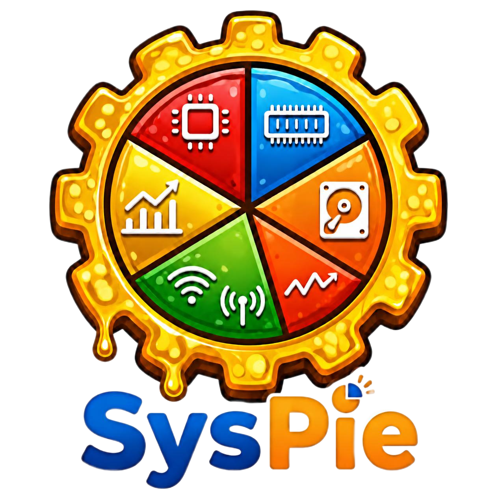
</p>

<p align="center">
SysPie is a Windows process explorer and system monitoring tool with a modern UI. <br>
provides process, service, user and resource usage data with real-time updates, tables, chart visualization.
</p>

<p align="center">
  <a href="https://github.com/huzaifa4khtar/SysPie/releases/latest/download/SysPie-Setup-v1.0.0.exe"></a>
  <a href="mailto:huzaifa4khtar@gmail.com"></a>
  <a href="https://linkedin.com/in/huzaifa4khtar"></a>
  <a href="https://github.com/huzaifa4khtar/SysPie/blob/main/LICENSE"></a>
</p>

<br/>

<p align="center">
  
</p>

<br/>

<details>
  <summary>Table of Contents</summary>
  <ol>
    <li><a href="#introduction-to-syspie">Introduction to SysPie</a></li>
    <li><a href="#tech-stack">Tech Stack</a></li>
    <li><a href="#features">Features</a></li>
    <li><a href="#project-structure">Project Structure</a></li>
    <li><a href="#requirements">Requirements</a></li>
    <li>
      <a href="#getting-started">Getting Started</a>
      <ul>
        <li><a href="#for-users">For Users</a></li>
        <li><a href="#for-developers">For Developers</a></li>
      </ul>
    </li>
    <li>
      <a href="#contributing">Contributing</a>
      <ul>
        <li><a href="#how-to-contribute">How to Contribute</a></li>
        <li><a href="#top-contributors">Top Contributors</a></li>
      </ul>
    </li>
    <li><a href="#author">Author</a></li>
    <li><a href="#acknowledgements">Acknowledgements</a></li>
    <li><a href="#license">License</a></li>
    <li><a href="#ui-screenshots">UI Screenshots</a></li>
  </ol>
</details>

<br/>

## Introduction to SysPie

SysPie is a Windows system monitoring tool that gives you real-time visibility into your system's processes, services, and resources. Built with a Flutter UI and a C++ native layer connected via FFI, it delivers accurate system data with minimal overhead. <br/>
Unlike Electron-based monitors, SysPie runs as a true native Windows application. The C++ layer uses Win32 APIs directly to read process trees, service states, and performance counters.

**Key differentiators:**
- Completely open-source
- Modern, user friendly interface
- Native C++ layer with Win32 API access, no abstraction layers
- Real-time process diff engine, only updates what changed
- Batch operations on multiple processes simultaneously

<br/>

## Tech Stack

| Layer | Technology |
|-------|-----------|
| **UI** | [![Flutter][Flutter-shield]][Flutter-url] [![Dart][Dart-shield]][Dart-url] |
| **State Management** | [![Riverpod][Riverpod-shield]][Riverpod-url] |
| **Charts** | [![fl_chart][flchart-shield]][flchart-url] |
| **Window Management** | [![window_manager][wm-shield]][wm-url] |
| **Native Backend** | [![C++][Cpp-shield]][Cpp-url] |
| **Windows Integration** | [![Win32][Win32-shield]][Win32-url] |
| **Installer** | [![Inno Setup][Inno-shield]][Inno-url] |
| **Build Orchestration** | [![CMake][CMake-shield]][CMake-url] [![Ninja][Ninja-shield]][Ninja-url] |

<br/>

## Features

### Process Management
- Real-time process listing with both Display and Executable names, CPU, memory, disk, network, gpu, power usage.
- Process categorization (parent-child relationships)
- Processes Termination individually, or in batch
- Process icons extracted from executable files

### Process Details
- Dedicated details view with columns for Name, PID, Status, Username, UAC Virtualization, Disk Permission, and Parent Process
- Cross-navigation to Processes and Users screens and vice versa.

### Service Management
- Full Windows service enumeration with both display and svs/exe names.
- Start, stop, restart services
- Service status and startup type Group display
- Error logging for failed service operations

### System Resources
- CPU usage per core with historical charts (total, kernel, and user usage)
- Memory usage and available memory
- Disk read/write activity
- Network send/receive rates
- GPU utilization

### User Management
- Lists real user accounts filtered from running processes

### Search and Navigation
- Global search across processes and services
- Keyboard shortcut (Ctrl+K) for quick access
- Fuzzy matching for fast filtering

### UI/UX
- Modern Flutter UI
- Resizable sidebar navigation
- Context menus for process and service actions
- Status badges with color-coded indicators
- Smooth animations and transitions
- Quick-launch shortcuts for Resource Monitor, Task Manager, and Windows Services
- Admin elevation detection with one-click relaunch

<br/>

## Project Structure

```
SysPie
├── app/                        # Flutter application
│   ├── lib/
│   │   ├── core/               # Theme, bindings, constants, widgets
│   │   ├── features/           # Screens, controllers, services
│   │   ├── platform/           # Platform-specific code (elevation)
│   │   ├── shared/             # Models, shared services
│   │   └── main.dart           # Entry point
│   ├── assets/                 # App logo and icons
│   ├── test/                   # Unit and widget tests
│   ├── windows/                # Windows runner and CMake config
│   └── pubspec.yaml
├── native/                     # C++ native layer
│   ├── src/                    # C++ source files
│   ├── modules/                # C++ modules (cpu, disk, gpu, etc.)
│   ├── bindings/               # DLL export functions
│   ├── tests/                  # CTest logic tests
│   ├── CMakeLists.txt          # Native build config
│   └── build/                  # Compiled DLL output
├── setup/                      # Installer
│   ├── build_setup.bat         # Setup builder
│   ├── syspie.iss              # Inno Setup script
│   └── SysPie-Setup.exe  # Resulting installer
├── media/                      # App logo and UI screenshots
│   ├── syspie_logo_transparent.png
│   └── ui_screenshots/         # 12 UI screenshots
├── DESIGN.md                   # Design system document
├── LICENSE                     # AGPL-3.0
└── README.md
```

<br/>

## Requirements

- **Minimum Hardware**: 70 MB RAM, 35 MB disk, 100 MB Graphics memory, Intel Core 2 Duo CPU or equivalent
- **Operating System**: Windows 10 (version 1803+) or Windows 11, x64
- **Architecture**: 64-bit only
- GPU monitoring requires WDDM 2.0+ (Windows 10 RS4+)
- Some features (process termination, service management) require administrator privileges

<br/>

## Getting Started

### For Users

1. [Download](https://github.com/huzaifa4khtar/SysPie/releases/latest/download/SysPie-Setup-v1.0.0.exe) the latest version of SysPie.
2. Run `SysPie-Setup-v1.0.0.exe`
3. Follow the installation wizard
4. Launch SysPie from the Start Menu or desktop shortcut

The installer places SysPie in `C:\Users\<You>\AppData\Local\Programs\SysPie` by default (no admin privileges required).

> **Note:** You may see an antivirus or Windows SmartScreen warning. This is because this app is not certified yet, not because it contains any malware. SysPie is completely open-source, you can inspect the code before using it.

### For Developers

**Prerequisites:**
- [Flutter SDK](https://docs.flutter.dev/get-started/install) (3.x or later)
- [Visual Studio](https://visualstudio.microsoft.com/) with "Desktop development with C++" workload
- [CMake](https://cmake.org/download/) (included with Visual Studio)
- [Inno Setup 6](https://jrsoftware.org/isinfo.php) (for building installer)

**Build steps:**

```bash
# 1. Clone the repository
git clone https://github.com/huzaifa4khtar/SysPie.git
cd SysPie

# 2. Build the native C++ native layer
cd native
call build_native.bat
cd ..

# 3. Install Flutter dependencies and run
cd app
flutter pub get
flutter run -d windows
```

> **Note:** The native DLL (`syspie_native.dll`) is built to `native/build/Release/`. The Flutter app automatically locates it there during development. In production, the DLL is placed next to the executable by the installer.

**Run tests:**

```bash
# Flutter tests
cd app
flutter test

# Native logic tests (optional, requires CTest)
cd native
cmake -B build -S . -G "Ninja"
cmake --build build --config Release --target syspie_native_tests
ctest --test-dir build
```

**Build the installer:**

```bash
# From project root
setup\build_setup.bat
```

<br/>

## Contributing

If you want to contribute to this project, you are more than welcome to do so, together we can make this tool even more helpfull.

### How to Contribute

1. **Fork the repository**
   ```bash
   # Click the "Fork" button on the top right of the repo page
   ```

2. **Clone your fork**
   ```bash
   git clone https://github.com/<your-username>/SysPie.git
   cd SysPie
   ```

3. **Create a feature branch**
   ```bash
   git checkout -b feature/your-feature-name
   ```

4. **Make your changes**
   - Follow the existing code style and conventions
   - Keep changes focused, one feature or fix per PR
   - Test your changes before committing

5. **Build and verify**
   ```bash
   # Build the native layer
   cd native
   call build_native.bat
   cd ..

   # Run Flutter tests
   cd app
   flutter test
   flutter analyze
   ```

6. **Commit your changes**
   ```bash
   git add .
   git commit -m "Add: brief description of your change"
   ```

7. **Push to your fork**
   ```bash
   git push origin feature/your-feature-name
   ```

8. **Open a Pull Request**
   - Go to the original repo and click "New Pull Request"
   - Select your feature branch
   - Provide a clear title and description of your changes
   - Reference any related issues

### Top Contributors

<a href="https://github.com/huzaifa4khtar/SysPie/graphs/contributors">
  
</a>

<br/>
<br/>

## Author

**Huzaifa Akhtar**

<a href="https://github.com/huzaifa4khtar"></a>
<a href="https://linkedin.com/in/huzaifa4khtar"></a>
<a href="mailto:huzaifa4khtar@gmail.com"></a>

<br/>

## Acknowledgements

I would like to thank the following resources and individuals:

- [System Informer](https://systeminformer.sourceforge.io/) for native NT API patterns for process enumeration, termination, and CPU stats.
- [Raymond Chen](https://devblogs.microsoft.com/oldnewthing/) for the Windows Task Manager process classification algorithm.
- [Icons8](https://icons8.com/) for providing some icons for this application.
- [ColorKit](https://colorkit.co/) for providing color palettes used in designing of this application.
- [shields.io](https://shields.io/) for badge images used in this README.
- [contrib.rocks](https://contrib.rocks) for auto-generated contributor avatars.
- [Best-README-Template](https://github.com/othneildrew/Best-README-Template) for the README structure reference.

A special thanks to all the devs and contributors of the packages, tools and frameworks listed in the <a href="#tech-stack">Tech Stack</a> section.

<br/>

## License

This project is licensed under the [GNU Affero General Public License v3.0](LICENSE).

<br/>

## UI Screenshots

<p align="center">
  <strong>Processes Screen</strong><br/>
  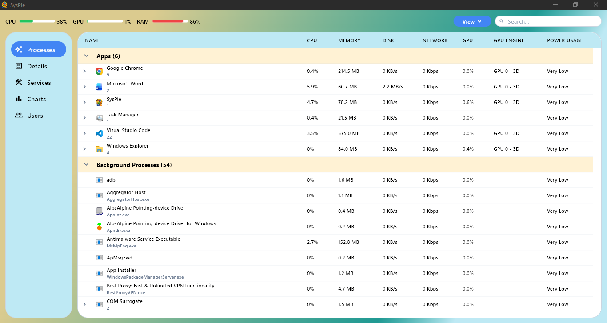
</p>

<br/>

<p align="center">
  <strong>Process Details</strong><br/>
  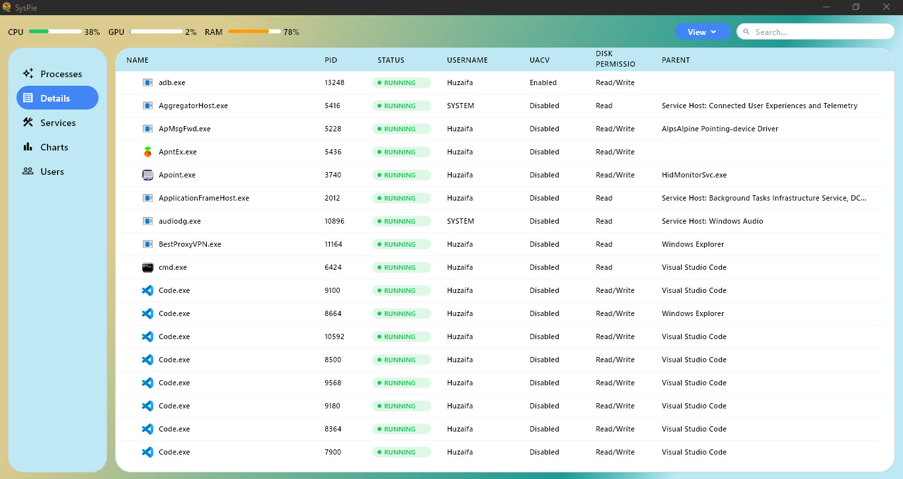
</p>

<br/>

<p align="center">
  <strong>Services Screen</strong><br/>
  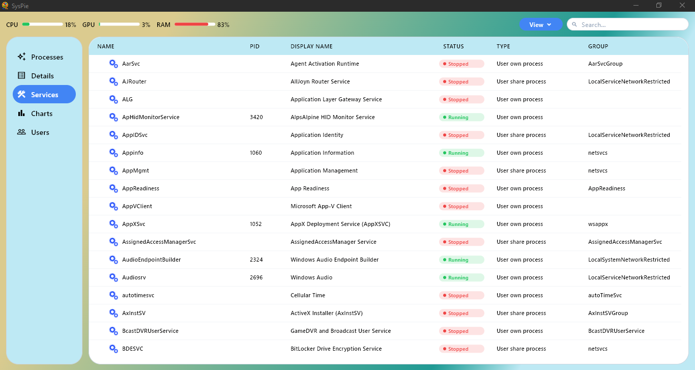
</p>

<br/>

<p align="center">
  <strong>Charts - CPU</strong><br/>
  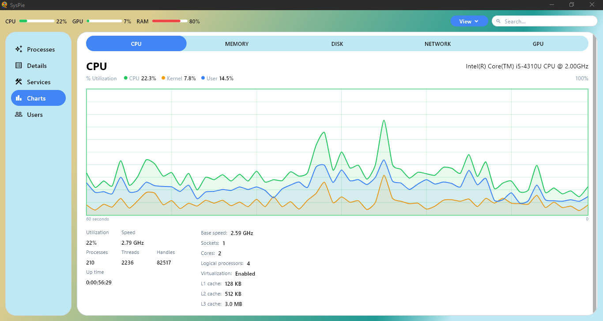
</p>

<br/>

<p align="center">
  <strong>Charts - Memory</strong><br/>
  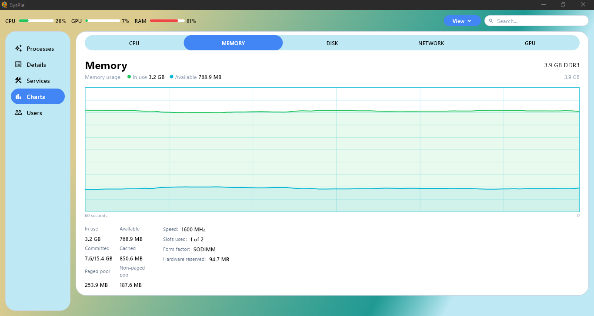
</p>

<br/>

<p align="center">
  <strong>Charts - Disk</strong><br/>
  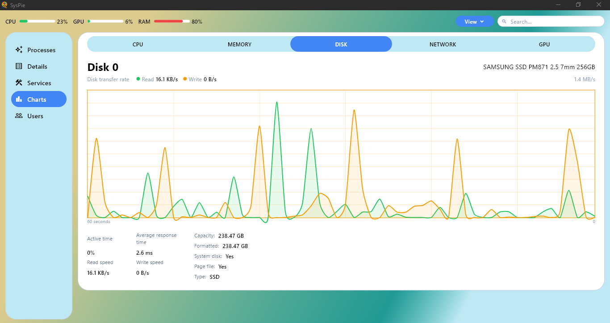
</p>

<br/>

<p align="center">
  <strong>Charts - Network</strong><br/>
  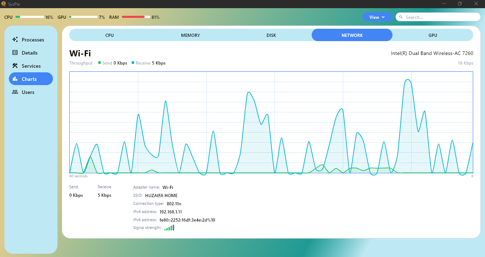
</p>

<br/>

<p align="center">
  <strong>Charts - GPU</strong><br/>
  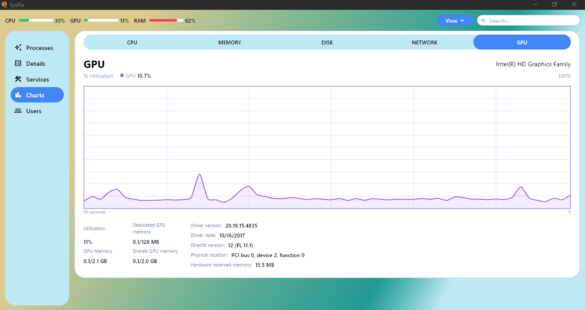
</p>

<br/>

<p align="center">
  <strong>Users Screen</strong><br/>
  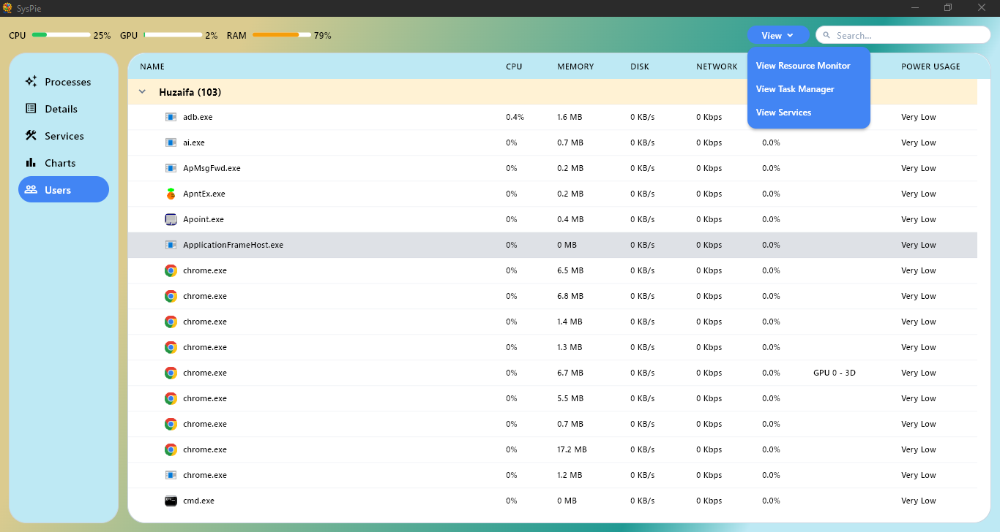
</p>

<br/>

<p align="center">
  <strong>Search Feature</strong><br/>
  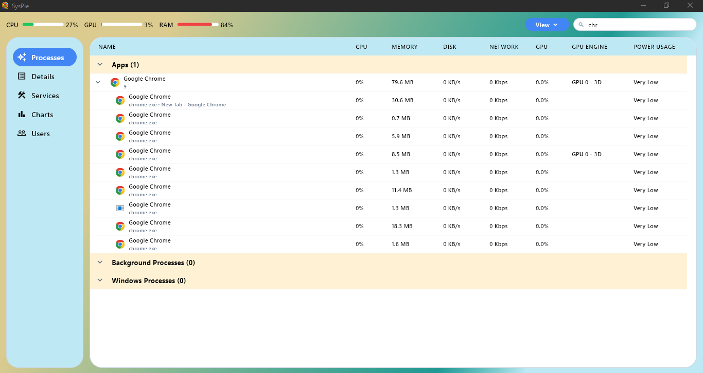
</p>

<br/>

<p align="center">
  <strong>Services Context Menu</strong><br/>
  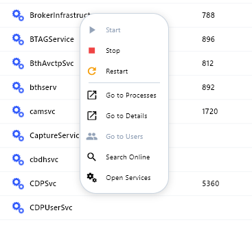
</p>

<br/>

<p align="center">
  <strong>Processes Context Menu</strong><br/>
  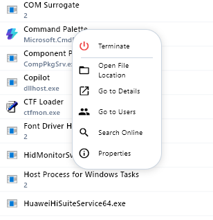
</p>

<br/>

<!-- MARKDOWN LINKS & IMAGES -->
[Flutter-shield]: https://img.shields.io/badge/Flutter-02569B?style=for-the-badge&logo=flutter&logoColor=white
[Flutter-url]: https://flutter.dev
[Dart-shield]: https://img.shields.io/badge/Dart-0175C2?style=for-the-badge&logo=dart&logoColor=white
[Dart-url]: https://dart.dev
[Cpp-shield]: https://img.shields.io/badge/C++-00599C?style=for-the-badge&logo=cplusplus&logoColor=white
[Cpp-url]: https://isocpp.org
[CMake-shield]: https://img.shields.io/badge/CMake-064F8C?style=for-the-badge&logo=cmake&logoColor=white
[CMake-url]: https://cmake.org
[Ninja-shield]: https://img.shields.io/badge/Ninja-000000?style=for-the-badge&logo=ninja-build&logoColor=white
[Ninja-url]: https://ninja-build.org
[Riverpod-shield]: https://img.shields.io/badge/Riverpod-0040FF?style=for-the-badge&logo=dart&logoColor=white
[Riverpod-url]: https://riverpod.dev
[flchart-shield]: https://img.shields.io/badge/fl_chart-02569B?style=for-the-badge&logo=flutter&logoColor=white
[flchart-url]: https://pub.dev/packages/fl_chart
[wm-shield]: https://img.shields.io/badge/window_manager-02569B?style=for-the-badge&logo=flutter&logoColor=white
[wm-url]: https://pub.dev/packages/window_manager
[Win32-shield]: https://img.shields.io/badge/Win32_API-0078D4?style=for-the-badge&logo=microsoft&logoColor=white
[Win32-url]: https://learn.microsoft.com/en-us/windows/win32/
[Inno-shield]: https://img.shields.io/badge/Inno_Setup-3C7A36?style=for-the-badge&logo=inno-setup&logoColor=white
[Inno-url]: https://jrsoftware.org/isinfo.php
